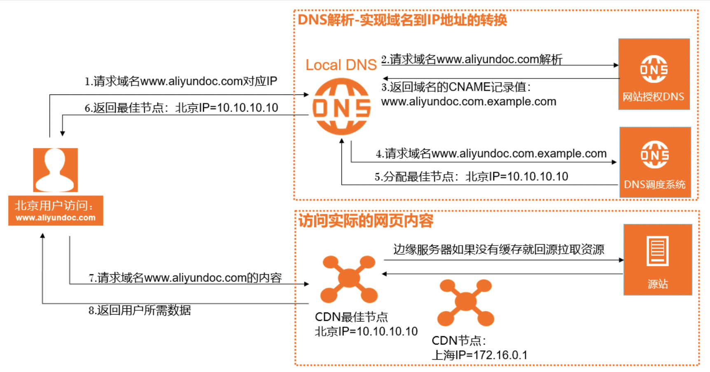

## CDN

CDN = Content Delivery Network，即内容分发网络，指的是一组分布在各个地区的服务器组成的网络。这些服务器存储着数据的副本，因此服务器可以根据哪些服务器与用户距离最近，来满足数据的请求。CDN 有如下优势：

- 通过 CDN 向用户分发传输静态资源文件，可以降低我们自身服务器的请求压力。
- 大多数 CDN 在全球都有服务器，所以 CDN 上的服务器在地理位置上可能比你自己的服务器更接近你的用户。地理距离会按比例影响延迟。
- 通过多节点冗余，保证内容的高可用性和可靠性。

### CDN 工作流程

1. 以阿里云的 CDN 服务为例，当终端用户向`www.aliyundoc.com`下的指定资源发起请求时，首先向 Local DNS（本地 DNS）发起请求域名`www.aliyundoc.com`对应的 IP。
2. Local DNS 检查缓存中是否有`www.aliyundoc.com`的 IP 地址记录。如果有，则直接返回给终端用户；如果没有，则向网站授权 DNS 请求域名`www.aliyundoc.com`的解析记录。
3. 当网站授权 DNS 解析`www.aliyundoc.com`后，返回域名的 CNAME `www.aliyundoc.com.example.com`。
4. Local DNS 向阿里云 CDN 的 DNS 调度系统请求域名`www.aliyundoc.com.example.com`的解析记录，阿里云 CDN 的 DNS 调度系统将为其分配最佳节点 IP 地址。
5. Local DNS 获取阿里云 CDN 的 DNS 调度系统返回的最佳节点 IP 地址。
6. Local DNS 将最佳节点 IP 地址返回给用户，用户获取到最佳节点 IP 地址。
7. 用户向最佳节点 IP 地址发起对该资源的访问请求。

>**CNAME**（Canonical Name Record）记录用于将域名（别名）映射到另一个域名（真实名称，目标）。当用户访问别名域名时，DNS服务器会将请求重定向到目标域名，并返回目标域名的IP地址。这样，用户的请求最终会被发送到目标域名所在的服务器上。
>
>这对于需要在同一个IP地址上运行多个服务的情况来说非常方便。若要同时运行文件传输服务和Web服务，则可以把*ftp.example.com*和 *www.example.com* 都指向DNS记录 *example.com*，而后者则有一个指向 IP 地址的 A 记录。如此一来，若服务器 IP 地址改变，则只需修改 *example.com* 的 A 记录即可。
>
>CNAME 记录指向的是另一个域名，而不是 IP 地址。
>
>使用 `nslookup -qt-cname www.test.com` (Windows) 或 `dig www.test.com` (Unix) 查询 CNAME。

>**DNS 服务器**（Domain Name System Server，域名系统服务器）是一种网络服务器，它负责将域名转换为对应的 IP 地址。本地 DNS 服务器收到查询请求后，会首先检查自己的缓存中是否有该域名对应的 IP 地址。如果有，它会立即返回 IP 地址给用户的浏览器。如果没有，本地 DNS 服务器会向根 DNS 服务器发送查询请求。

### 基本概念

- **节点（Edge Server）**：CDN 部署在全球各地的服务器，用于缓存和分发内容。
- **源站（Origin Server）**：用户内容的原始存储位置，CDN 从源站获取内容并缓存到节点。
- **缓存（Cache）**：将源站的内容临时存储在 CDN 节点，减少对源站的访问次数。
- **回源（Back to Origin）**：当节点没有缓存所需内容时，向源站请求内容的过程。

### 常用功能

#### 资源刷新

强制删除 CDN 所有节点上的缓存资源，当用户向 CDN 节点请求资源时，CDN 会直接回源站获取对应的资源并返回，同时将资源重新缓存到 CDN 节点。刷新功能会降低缓存命中率，但是能保证用户获取到最新的内容。一般用于资源更新和发布，以及违规资源清理等。

#### 资源预热

源站主动将对应的资源缓存到 CDN 节点，当客户首次请求资源时，即可直接从 CDN 节点获取到最新的资源，无需再回源站获取。预热功能会提高缓存命中率，但是会造成源站短时高负载。一般用于运营大型活动，以及安装包发布等。

### CDN 配置

有需要的同学可以自行阅读腾讯云的 [从零开始配置 CDN](https://cloud.tencent.com/document/product/228/3149) 或阿里云 [快速入门](https://help.aliyun.com/zh/cdn/getting-started/?spm=a2c4g.11186623.0.0.6ad95c9eJFuuiJ)。