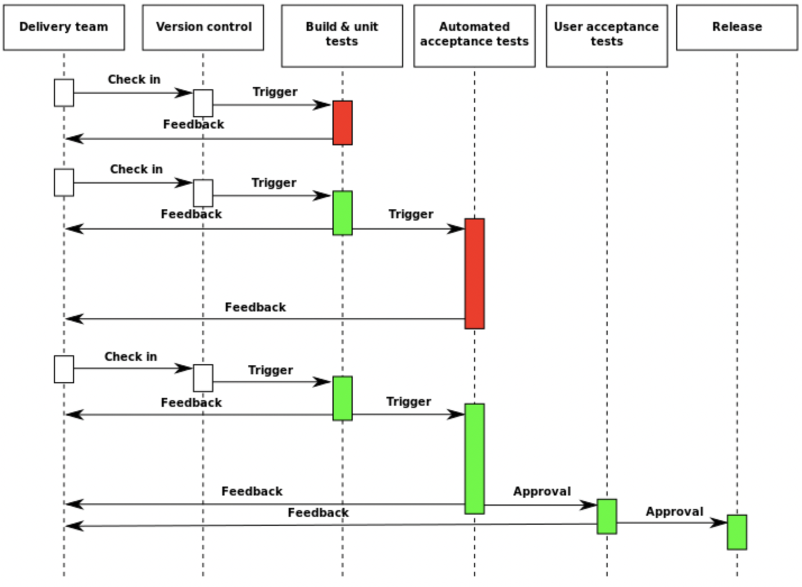
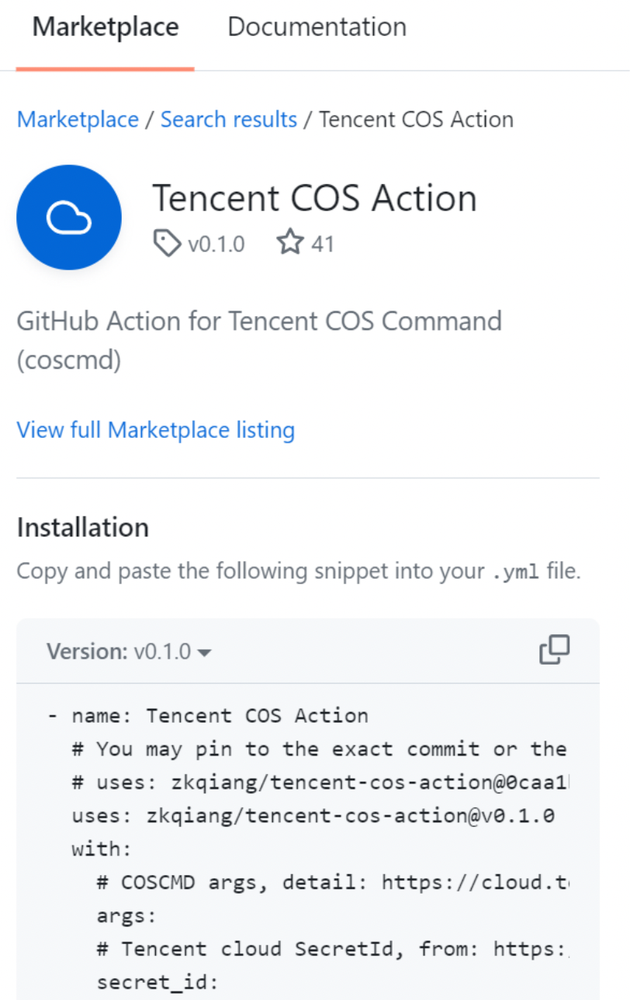

## CI/CD

### CI

**CI（持续集成，Continuous Integration）**：是将所有软件工程师对于软件的工作副本持续集成到共享主线（mainline）的一种举措。在测试驱动开发（TDD）的作法中，通常还会搭配自动单元测试。

（极限编程中，测试驱动开发指先完成测试代码，再快速写代码完成功能。先实现功能，在测试的辅助下，快速实现其功能；再重构，在测试的保护下，通过去除冗余的代码，提高代码质量。）

在模块化的开发中，各人独立开发不同的模块时，持续集成也起到很大作用。

### CD

**CD（持续交付，Continuous Delivery / 持续部署，Continuous Deployment）**：持续部署指在软件开发流程中，以自动化方式，频繁而且持续性的，将软件部署到生产环境中。持续交付与持续部署的区别在于，持续交付指所有的变更都可以被部署到生产环境中，但是出于业务考虑，可以选择不部署。

### 应用场景

举个简单的例子，我们在进行 THUAI6 的开发时，每进行一次修改，就要先进行代码风格和编译是否通过的检查，然后将镜像重新上传到 docker hub，再将修改后的代码进行打包，形成选手包，上传到存储桶。更复杂的工程可能还涉及到发布一些版本。然而手动进行这些工作过于繁琐，我们就可以通过 CI/CD 这种自动化工具进行实现。





> Common practices
>
> 1. Maintain a code repository
> 2. Automate the build
> 3. Make the build self-testing
> 4. Everyone commits to the baseline every day
> 5. Every commit (to baseline) should be built
> 6. Every bug-fix commit should come with a test case
> 7. Keep the build fast
> 8. Test in a clone of the production environment
> 9. Make it easy to get the latest deliverables
> 10. Everyone can see the results of the latest build
> 11. Automate deployment


## Github Actions

GitHub Actions 是一种持续集成和持续交付 (CI/CD) 平台，可用于自动执行生成、测试和部署管道。可配置 GitHub Actions 工作流（workflow），使其在存储库中发生事件（例如打开拉取请求或创建问题）时触发 。 工作流包含一个或多个可按顺序或并行运行的Job。 每个 Job 都将在其自己的虚拟机运行器中或在容器中运行，并具有一个或多个 step，用于运行定义的脚本或运行 Action。Action 是一个可重用的扩展，可简化工作流。工作流程在存储库的 `.github/workflows` 目录中定义，存储库可以有多个工作流程。GitHub Actions使用 YAML 语法来定义工作流程。 每个工作流都作为单独的 YAML 文件存储在代码存储库中名为 `.github/workflows` 的目录中。

目前清华电子系学生科协网站的 CI/CD 方式是：通过 GitHub Actions 实现持续集成，并将代码编译后推至 docker hub，由服务器端的 watchtower 容器自动检测镜像的更新并自动拉取运行，实现持续部署。

### 使用 Github Action

在 `.github`下创建 `workflows` 文件夹，并在其中创建 `.yml` 文件。

工作流文件的示例如下，功能是在推送或拉取请求到 `master` 分支时自动测试代码，并在推送到 `master` 分支时成功后自动构建和部署 Docker 镜像。

```yaml
name: deploy

on:
  push:
    branches: [main]
  pull_request:
    branches: [main]

jobs:
  test:
    runs-on: ubuntu-latest
    steps:
      - uses: actions/checkout@v4
      - name: Use Node.js ${{matrix.node-version}}
        uses: actions/setup-node@v4
        with:
          node-version: "20.5.0"
      - name: get yarn cache path
        id: yarn-cache-dir-path
        run: echo "::set-output name=dir::$(yarn cache dir)"
      - uses: actions/cache@v4
        id: yarn-cache
        with:
          path: ${{steps.yarn-cache-dir-path.outputs.dir}}
          key: ${{runner.os}}-yarn-${{hashFiles('**/yarn.lock')}}
          restore-keys: |
            ${{runner.os}}-yarn-
      - name: install dependencies
        run: yarn
      - name: test
        run: |
          yarn lint
          yarn typecheck
          yarn build

  deploy:
    if: github.event_name == 'push'
    needs: test
    runs-on: ubuntu-latest
    steps:
      - uses: actions/checkout@v4
      - name: docker log in
        run: echo "${{secrets.DOCKER_PASSWORD}}" | docker login -u "${{secrets.DOCKER_USERNAME}}" --password-stdin
      - name: build and deploy image
        shell: bash
        run: |
          docker build -t eesast/api:latest .
          docker push eesast/api:latest
      - name: Trigger watchtower on server
        run: |
          curl "https://eesast.com/v1/update?image=eesast%2Fapi" \
               -H "Authorization: Bearer ${{ secrets.WATCHTOWER_HTTP_API_TOKEN }}"
```

- `name`：可选项，指定 workflow 的名称，将出现在 github 的 Action 中。

- `on`：定义 workflow 的触发条件。
  - `push`：在推送到 `master` 分支时触发工作流程。
  - `pull_request`：在向 `master` 分支发起 pr 时触发工作流程。
- `branches`：限制触发的分支。上面的 workflow 只能在 main 分支中触发。
- `jobs`：可以理解为工作列表。这里定义一个名为 `test` 的作业和一个名为 `deploy` 的作业。
- `if`：条件判断。这里 `deploy` 作业只有在事件类型为 `push` 时才会运行。
  - 当向 `master` 分支发起拉取请求时，只有 `test` 作业会运行，`deploy` 作业不会运行。
- `needs`：指定 `deploy` 作业依赖于 `test` 作业。
  - 当推送到 `master` 分支时，`test` 作业首先运行。如果 `test` 作业成功，`deploy` 作业才会运行。
- `runs-on`指定运行作业的环境，这里使用最新的 Ubuntu 环境 (`ubuntu-latest`)。
- `steps`：指定当前任务的步骤列表。
- `name`: 步骤名称，用于描述这一步骤的功能。
- `uses`：指定使用某一写好的 action，可以在 github-action 的 Marketplace 中搜索现成的 action，也可以自定义。比如 `action/checkout@v4` 就是一个 github 上提供的将仓库中的代码复制到运行器上的 action。可以让仓库中的代码在 github 的运行器中运行。除此之外，还有非常丰富的 action，大家可以自行探索。这里举个简单的例子。之前我们讲了对象存储的使用。在 Marketplace 可以找到 [Tencent COS Action](https://github.com/marketplace/actions/tencent-cos-action) 帮助我们将代码自动上传到存储桶中。我们只需要将示例代码复制到我们自己的workflow 中，并按照说明填写参数。



- `id`：为步骤分配一个 ID，后续步骤可以引用，例如 `yarn-cache-dir-path`。
- `run：`执行的命令。例如 `echo "::set-output name=dir::$(yarn cache dir)"` 使用 `echo` 命令设置 GitHub Actions 的输出变量，名称为 `dir`，值为 `$(yarn cache dir)` 命令的结果。
- `with`: 提供动作所需的参数。

### 变量

可以引用前序步骤中产生的变量，如 `path: ${{steps.yarn-cache-dir-path.outputs.dir}}`，也可以引用环境变量，如 `run: echo "${{secrets.DOCKER_PASSWORD}}" | docker login -u "${{secrets.DOCKER_USERNAME}}" --password-stdin`。

其中， `PASSWORD` 之类的变量要写在环境变量中，这样不会泄露敏感信息。例如，可在 Settings-Secrets and Variables-Actions 中配置存储库级配置变量，该变量适用于整个存储库，适合全局不变的配置。又如，在 Settings-Environments 中配置环境级配置变量，该变量适用于特定环境，适合在不同环境下变化的配置。更多变量用法详见 [actions-variables](https://docs.github.com/zh/actions/learn-github-actions/variables)。

### 更多

更多 关于 GitHub-Action 的用法详见 [Github actions 文档](https://docs.github.com/zh/actions)。


## Renovate 

Renovate 是一个开源的依赖管理工具，用于自动更新项目的依赖项。它可以帮助开发者保持项目的依赖项始终是最新的，从而提高项目的安全性和稳定性。项目详见 [renovate](https://github.com/renovatebot/renovate)。

Renovate 会定期扫描项目中的依赖项文件（如 `package.json`、`requirements.txt` 等），并自动创建拉取请求（PR）来更新过时的依赖项。可以通过配置文件（如 `renovate.json` 或 `renovate.config.js`）来自定义更新策略、排除某些依赖项、设置更新频率等。同时，可以与现有的 CI/CD 工具集成，如 GitHub Actions、GitLab CI、Jenkins 等。


Renovate 可以通过 Github App 安装，参见 [app-renovate](https://github.com/apps/renovate)。安装和使用教程参考 [renovate-tutorial](https://github.com/renovatebot/tutorial)，这里给出 [eesast-web](https://github.com/eesast/web) 仓库的配置文件示例。感兴趣的可以自行探索。

```json
{
  "extends": ["config:base"],
  "automerge": true,
  "timezone": "Asia/Shanghai",
  "schedule": "after 4am and before 8am every saturday",
  "lockFileMaintenance": {
    "enabled": true,
    "schedule": "after 10pm on saturday"
  },
  "prConcurrentLimit": 0,
  "prHourlyLimit": 5,
  "rangeStrategy": "pin",
  "separateMajorMinor": true,
  "separateMinorPatch": true,
  "separateMultipleMajor": true
}
```

