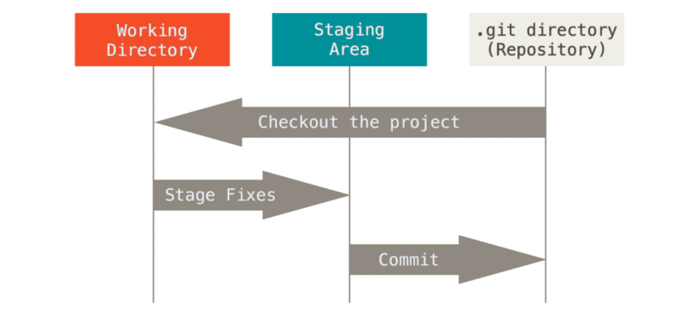

# Git Tutorial 2024

​																									    						           **陈子熠**

### 一、什么是Git？

- Git 是目前世界上最先进的分布式版本控制系统。

### 二、为什么需要 Git？

- **版本控制**：Git 允许开发者跟踪和管理代码的历史变更。这样，可以轻松回溯到之前的版本，查看代码变更历史，找出引入问题的更改。
- **团队协作**：在团队项目中，多个人可能同时对同一代码库进行更改。Git 通过分支和合并功能支持多人协作，减少了代码冲突的发生。
- **代码备份**：由于 Git 是分布式的，每个开发者的本地仓库都是一个完整的备份，这增加了数据的安全性和恢复能力。
- **灵活的工作流程**：Git 支持多种工作流程，如功能分支、Gitflow、Forking 工作流等，适应不同项目和团队的需求。
- **代码审查**：通过 Pull Request（PR）或 Merge Request（MR），Git 促进了代码审查的过程，提高了代码质量。

### 三、Git 的安装

#### 3.1 Windows

- 下载 [地址](https://git-scm.com/download/win) ，选择 Standalone Installer 版本。
- 安装教程参见 [Windows系统Git安装教程（详解Git安装过程） ](https://www.cnblogs.com/xueweisuoyong/p/11914045.html)。
- 安装完成后，在开始菜单里找到 “Git”->“Git Bash”（或在文件夹空白处右击 Open Git Bash here），蹦出一个类似命令行窗口的东西，就说明 Git 安装成功！
- 注：如果您习惯了 Linux 并希望保持相同的习惯，则可以把 Git Bash 作为默认终端日常使用。

#### 3.2 MacOS

- 参见 [Download for macOS](https://git-scm.com/download/mac)。

#### 3.3 Linux

- `sudo apt-get install git`

### 四、开发环境

- 了解 Unix 常用命令，如 ls/cd/pwd/rm/touch/mkdir 等（这几个差不多够用了）。
- Git、Git Bash（或其它 UNIX shell）、vscode
- 一个已注册的 GitHub 账户

### 五、Git 命令

#### 5.1 设置用户名和邮件地址

```bash
git config --global user.name "Your Name"
git config --global user.email "email@example.com"
```

- `--global`参数表示你这台机器上所有的 Git 仓库都会使用这个配置，当然也可以选择对某个仓库指定不同的用户名和 Email 地址。

#### 5.2 创建版本库

- 文件的三种状态

  1. 已修改（**modified**）：表示修改了文件，但还没保存到数据库中。
  2. 已暂存（**staged**）：表示对一个已修改文件的当前版本做了标记，使之包含在下次的提交中。
  3. 已提交（**committed**）：表示数据已经安全地保存在本地数据库中。

- 基本的 Git 工作流程如下（见附录 9.1）：

  1. 在**工作区**中修改文件，文件状态为已修改，未暂存。

  2. 将你想要下次提交的更改选择性地暂存，这样只会将更改的部分添加到**暂存区**，文件状态为已暂存。

  3. 提交更新，找到暂存区的文件，将快照永久性存储到 Git 目录，文件状态为已提交。

- 初始化 Git 仓库

  ```bash
  git init
  ```

- 将修改的文件提交到暂存区。

  ```bash
  git add example.txt
  git add .
  ```
  
- 提交更新

  ```bash
  git commit -m "commit message"
  ```

- 修改提交

  ```bash
  git commit --amend -m “this fixes the previous oopsies”
  git commit --amend --no-edit
  ```
  
- *.gitignore*：设置文件的忽略规则，让一些文件不会被记入仓库的更改中。常见的情况是编译出的可执行文件或中间文件，不需要也不应当出现在代码仓库里。模版参考 [collection of .gitignore templates](https://github.com/github/gitignore)。

- *.gitattributes*：设置文件的属性。用法参见 [docs.eesast](https://github.com/github/gitignore) 

- 注 1：包括 Git 在内的版本控制系统只能跟踪文本文件的改动。而图片、视频、Microsoft Word 等二进制文件，虽然也能由版本控制系统管理，但没法跟踪文件的变化，只能把二进制文件每次改动串起来，也就是只知道图片从 100KB 改成了 120KB，但到底改了啥，版本控制系统不知道，也没法知道。

- 注 2：如果某天发现 Git 的命令几乎无法使用，建议首先检查是否已初始化当前仓库。

#### 5.3 版本管理

- 查看当前仓库的状态

  ```bash
  git status
  ```

- 查看文件修改内容

  ```bash
  git diff example.txt
  ```

- 撤销工作区的修改

  ```bash
  git checkout -- example.txt
  ```

- 撤销暂存区的修改

  ```bash
  git reset HEAD example.txt
  ```

- 打印仓库的提交日志

  ```bash
  git log
  ```

- 打印命令历史

  ```bash
  git reflog
  ```

- 版本回退

  ```bash
  git reset --hard HEAD^
  git reset --hard HEAD~99 # 前99个版本
  git reset --hard 12345 # commit id
  ```

- 注 1：Git 的版本控制采用的是全量快照的方式，把修改的文件集合打个版本，其版本回退只是移动了指向当前版本的`HEAD`指针，因此速度非常快。

- 注 2：`git diff ` 的详细用法参见 [Git diff 常见用法](https://www.cnblogs.com/qianqiannian/p/6010219.html) 。

- 注 3：`git checkout -- `其实是用版本库里的版本替换工作区的版本，因此可用于恢复误删的文件，但前提是版本库里存在历史版本（已暂存或已提交）

- 注 4：`git reset` 中 `-–hard` 参数表示直接回退到指定的 commit，该参数会将 HEAD 指向该 commit，并且工作区中的文件也会和该 comit 保持一致。取消 `-–hard` 参数会使得回退前的版本修改的文件位于工作区，并处于 Unstaged 状态。

- 注 5：Git 的本质是一个文件系统，其工作目录中的所有文件的历史版本以及提交记录都是以文件对象的方式保存在 .git 目录中的，其目录结构见附录 9.2，文件对象的关系（指针）参见附录 9.3。略过这部分内容不会对 Git 的使用产生太大影响。进一步了解 Git 内部存储原理可以参见[这篇 blog](https://www.zhaohuabing.com/post/2019-01-21-git/)。

#### 5.4 分支管理

- 创建与切换分支

  ```bash
  git branch dev # 创建
  git checkout dev # 切换
  # 或 git switch dev
  git checkout -b dev # 创建并切换
  # 或 git switch -c dev
  ```

- 查看当前分支

  ```bash
  git branch -al
  ```

- 合并指定分支到当前分支

  ```bash
  git merge dev
  git merge --no-ff -m "merge with no-ff" dev
  ```

- 删除分支

  ```bash
  git branch -d dev
  git branch -D dev # 强制删除
  ```

- 临时保存当前分支的修改

  ```bash
  git stash
  ```

- 查看临时保存的修改

  ```bash
  git stash list
  ```

- 恢复临时保存的修改并删除保存记录

  ```bash
  git stash apply # 恢复
  git stash drop # 删除
  git stash pop # 恢复并删除
  ```

- 复制特定的提交到当前分支

  ```bash
  git cherry-pick 12345 # commit id
  ```

- 可视化分支的合并情况

  ```bash
  git log --pretty=oneline --graph --abbrev-commit
  ```

- 变基

  ```bash
  git rebase
  ```

- 冲突处理：不同分支产生冲突时无法自动合并，必须手动解决冲突后再提交。使用`git status`可查看冲突文件。通常在 vscode 中完成。

- 分支管理策略：在实际开发中，我们应该按照几个基本原则进行分支管理。

  1. 首先，`main`分支应该是非常稳定的，也就是仅用来发布新版本，平时不能在上面干活；
  1. 干活都在`dev`分支上，也就是说，`dev`分支是不稳定的，到某个时候，比如 1.0 版本发布时，再把`dev`分支合并到`main`上，在`main`分支发布 1.0 版本。
  1. 小伙伴们都在`dev`分支上干活，每个人都有自己的分支，时不时地往`dev`分支上合并就可以了。

- 注 1：`git merge` 默认启用`fast forward`合并（无冲突下），这种模式下并不会产生新的 commit，合并本质上是完成了指针的移动，在删除被合并的分支后看不出来曾经做过合并。`--no-ff` 的作用是强制禁用`Fast forward`模式，此时无论是否产生冲突都会形成一次新的 commit。

- 注 2：`git rebase` 的作用是将提交逐个应用到目标分支上，并按照提交顺序重新组织提交历史。这种操作可以让代码库的提交历史更加整洁、线性，并且方便后续的代码审查和维护。但可能需要解决多次冲突，且具有一定风险性。参见 [一文搞懂 git rebase](https://juejin.cn/post/7038093620628422669)。


### 六、Git 与 GitHub

#### 6.1 SSH 配置

- 在用户主目录下找到 .ssh 文件夹（Windows 位于C:/Users/用户名/.ssh），看看这个目录下有没有`id_rsa`和`id_rsa.pub`这两个文件。如果没有，打开Shell（Windows下打开Git Bash），使用如下命令创建SSH Key，然后一路回车（密码可以不设置）。

  ```bash
  ssh-keygen -t rsa -C "youremail@example.com"
  ```

- 将`id_rsa.pub`中的内容（公钥）复制到 [GitHub SSH keys](https://github.com/settings/keys) 并保存。

#### 6.2 远程仓库

- 添加远程库

  ```bash
  git remote add origin https://github.com/username/new_repository.ssh
  git remote add alex git@github.com:username/new_repository.git
  git remote add pb ssh://git@ssh.github.com:443/username/new_repository.git
  ```

- 将本地分支推送到远程

  ```bash
  git push -u origin main # 推送并关联同名分支
  git push origin dev # 推送到同名分支
  git push origin dev:remote_dev # 推送到指定分支
  git push # 默认推送已关联的分支
  ```

- 将远程分支拉取到本地

  ```bash
  git pull origin remote_dev # 与 push 类似
  git pull origin remote_dev:dev
  git pull
  ```

- 克隆远程库到本地

  ```bash
  git clone [URL]
  git clone --recursive [URL]
  ```

- 创建远程分支到本地

  ```bash
  git checkout -b dev origin/dev
  ```

- 查看远程库信息

  ```bash
  git remote -v
  ```

- 删除远程库

  ```bash
  git remote rm origin
  ```

- 导入 submodule

  ```bash
  git submodule add -b stable [URL] [PATH]
  git submodule update --init
  ```

- 多人协同的基本工作模式

  1. 首先，可以试图用`git push origin <branch-name>`推送自己的修改。
  2. 如果推送失败，则因为远程分支比你的本地更新，需要先用`git pull`试图合并。
  3. 如果合并有冲突，则解决冲突，并在本地提交。
  4. 没有冲突或者解决掉冲突后，再用`git push origin <branch-name>`推送就能成功。
  5. 如果`git pull`提示`no tracking information`，则说明本地分支和远程分支的链接关系没有创建，用命令`git branch --set-upstream-to <branch-name> origin/<branch-name>`。

- 注 1：基于一些原因，与 GitHub 的交互可能会受到不可抗力的影响，但方法总比困难多。

- 注 2：基于 GitHub 的权限管理，有时首先需要 fork 远端仓库，在 fork 的仓库中提交，再对原仓库发起 pull request，详见 [Github Fork 使用详解](https://zhuanlan.zhihu.com/p/605697407) 。


### 七、Git 与 vscode

#### 7.1 GUI

- 充分利用图形化界面的优势，vscode 可以很方便地帮助追踪代码修改的历史、进行冲突处理等。

#### 7.2 Copilot

- vscode 安装 copilot 插件。
- GitHub 通过学生认证，参考 [Github学生认证及学生包保姆级申请指南](https://zhuanlan.zhihu.com/p/578964972) 。

### 八、参考资料

- https://www.liaoxuefeng.com/wiki/896043488029600

- https://git-scm.com/book/zh/v2

- 以及上文涉及到的所有文献

### 九、附录

#### 9.1 工作区与工作流程示意



#### 9.2 .git文件目录

```ASN.1
├── branches             不这么重要，暂不用管                    
├── config               git配置信息，包括用户名，email，remote repository的地址，本地branch和remote
│                        branch的follow关系
├── description          该git库的描述信息，如果使用了GitWeb的话，该描述信息将会被显示在该repo的页面上
├── HEAD                 工作目录当前状态对应的commit，一般来说是当前branch的head，HEAD也可以通过git checkout 命令被直接设置到一个特定的commit上，这种情况被称之为 detached HEAD      
├── hooks                钩子程序，可以被用于在执行git命令时自动执行一些特定操作，例如加入changeid
│   ├── applypatch-msg.sample
│   ├── commit-msg.sample
│   ├── post-update.sample
│   ├── pre-applypatch.sample
│   ├── pre-commit.sample
│   ├── prepare-commit-msg.sample
│   ├── pre-push.sample
│   ├── pre-rebase.sample
│   └── update.sample
├── info                不这么重要
│   └── exclude
├── objects             保存git对象的目录，包括三类对象commit,tag, tree和blob
│   ├── info
│   └── pack
└── refs                保存branch和tag对应的commit
    ├── heads           branch对应的commit
    └── tags            tag对应的commit
```

#### 9.3 Git 文件对象的关系示例

```
            HEAD
             |
             v                  (parent)
      refs/heads/work--> 4f7399 +-------> b767d7<---refs/heads/master
                        (commit)         (commit)
                           +                +
                           |                |
                           v                v
                      082b6d(tree)      ca964f(tree)
                           +                +
                           |                |
           +---------------+---------+    +-+------------------+
           |               |         |    |                    |
           v               v         v    v                    v
      9aeacd(tree)    8cc95f(blob) 065bca(blob)           824244(tree)
      src (version 2) Makefile       README            src (version 1)
           +                                                   +
           |                                                   |
           v                                                   v
      79ee69(blob)                                        3b18e5(blob)
      file1.txt (version 2)                      file1.txt (version 1)
```
