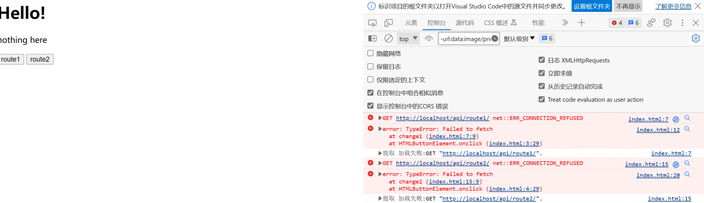
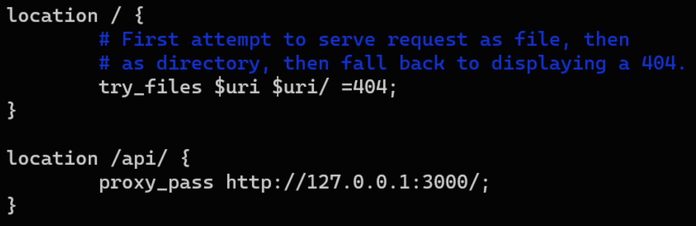
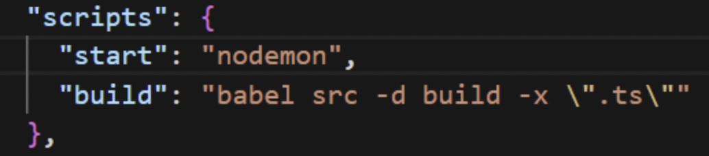

## Web 服务器

### 域名解析

当我们在浏览器上输入一个域名发送网络请求时，发生了什么呢？

首先，浏览器会去搜索浏览器自身的 DNS（域名服务器）缓存，如果存储有域名对应的 IP 地址，则缓存命中；否则去搜索操作系统自身的 DNS 缓存和 host 配置文件，如果没找到则去请求本地 DNS 服务器（一般在同一城市）进行解析，如果本地 DNS 服务器上还没有，则要由本地 DNS 服务器去请求 13 台 IPv4 或 25 台 IPv6 根服务器，最终将域名映射到 IP 地址。只要是用域名发送的网络请求，都要经历域名解析这一过程。


### 请求和响应

有了服务器的 IP 地址以后，客户端就可以同服务器经历握手建立 TCP/IP 连接。在连接建立后，客户端就可以向服务器发起 HTTP 请求，请求格式在之前已经讲解。服务器处理完毕后会将 HTTP 响应发回客户端，响应格式在之前也已经讲解。如果是浏览器向服务器发送请求，得到的响应是 HTML 文件，浏览器解析 HTML 文件来渲染页面，当遇到 js/css 或者图片等资源时，则再向服务器发送 HTTP 请求确认本地缓存的文件是否有修改，如果有修改则再次下载；当要进行 API 调用时，则通过本地的前端代码向服务器后端发送请求，由后端作出响应。

如果使用代理，那客户端就不再是直接同目标服务器建立连接，而是同代理服务器或反向代理服务器建立连接，间接地访问目标服务器。


### 代理与反向代理

正向代理是指，客户端先将请求发送至代理服务器这一中转站，再由代理服务器发送至目标服务器。在此过程中，客户端知道目标服务器的地址，但目标服务器不知道客户端的地址，只知道请求是从代理服务器发来的。反向代理则相反，反向代理服务器接受外部网络用户的请求并代表外部网络用户向内部服务器发出请求，对外表现为一个服务器。在此过程中，目标服务器知道客户端的地址，但客户端并不知道真正处理请求的内部服务器地址，其请求都发送给了反向代理服务器。下面这张图比较形象：


在服务端使用反向代理可以带来诸多好处，例如通过隔离外部网络用户和内部服务器增强了内部服务器上数据的安全性，减小了系统受攻击的危险。


## Nginx

Nginx 是一款著名的 Web 和反向代理服务器，此外还有 Apache 等。我们将使用 Nginx 完成前端和后端的通信，从而搭建一个具有完整功能的网站。

### 安装

```bash
sudo apt update
sudo apt install nginx
```


### 工作方式

Nginx 有一个主进程和多个工作进程。主进程的主要职责是读取和解析配置文件，并管理工作进程。而工作进程则负责实际处理客户端请求。Nginx 采用基于事件的模型（event-based）和依赖于操作系统（OS-dependent）的机制，来高效地将请求分配给工作进程。工作进程的数量在配置文件中定义，可以是固定的，也可以根据可用 CPU 核心的数量自动调整（参见 [worker_processes](https://nginx.org/en/docs/ngx_core_module.html#worker_processes)）。

Nginx 及其模块的工作方式由配置文件决定。默认情况下，配置文件名为 `nginx.conf`，放置在 `/usr/local/nginx/conf`、`/etc/nginx` 或 `/usr/local/etc/nginx` 目录中。


### 启动、停止和重新加载配置

要启动 Nginx，只需运行它的可执行文件。启动后，可以通过带 `-s` 参数的可执行文件来控制它。使用以下语法：

```bash
nginx -s signal
```

其中 signal 可以是以下之一：stop — 快速关闭

- quit — 优雅关闭
- reload — 重新加载配置文件
- reopen — 重新打开日志文件

例如，要停止 Nginx 并等待工作进程完成当前处理的请求，可以执行以下命令：

```bash
nginx -s reload
```

主进程收到重新加载配置的信号后，会检查新配置文件的语法是否正确，并尝试应用新配置。如果成功，主进程会启动新的工作进程，并通知旧的工作进程关闭。如果失败，主进程会回滚更改，继续使用旧配置。旧的工作进程接到关闭命令后，会停止接受新连接，但会继续处理当前请求，直到完成后再退出。

> 也可以使用 Unix 工具（如 kill）向 Nginx 进程发送信号。这种情况下，信号会直接发送到指定进程 ID 的进程。默认情况下，Nginx 主进程的进程 ID 会写入到 `/usr/local/nginx/logs` 或 `/var/run` 目录中的 `nginx.pid` 文件中。例如，如果主进程 ID 是 1628，要发送 QUIT 信号以优雅关闭 Nginx，可以执行：
>
> ```bash
> kill -s QUIT 1628
> ```
>
> 要获取所有正在运行的 Nginx 进程列表，可以使用 ps 工具，例如：
>
> ```bash
> ps -ax | grep nginx
> ```
>
> 有关向 Nginx 发送信号的更多信息，请参见 [Nginx 控制文档](https://nginx.org/en/docs/control.html)。

如果某些操作未按预期工作，可以在 `/usr/local/nginx/logs` 或  `/var/log/nginx` 目录中的 `access.log` 和 `error.log` 文件中查找原因。


### 配置文件结构

Nginx 由模块组成，这些模块由配置文件中的指令（directives）控制。指令分为简单指令（simple directives）和块指令（block directives）。

简单指令由名称和参数组成，参数之间用空格分隔，以分号（`;`）结尾，如：

```nginx
pid /var/run/nginx.pid;  # The file storing the process ID of the main process
```

块指令的结构与简单指令相同，但以大括号（`{` 和 `}`）包围的一组附加指令结尾。如果一个块指令内部可以包含其他指令，则称其为上下文（context），例如：`events`、`http`、`server` 和 `location`。

放置在配置文件中任何上下文之外的指令被视为处于主上下文（main context）中。`events` 和 `http` 指令位于主上下文中，`server` 位于 `http` 上下文中，`location` 位于 `server` 上下文中。这些上下文的用法将在后面介绍。


### 服务静态内容

Web 服务器的重要任务之一是提供文件服务（如图片或静态 HTML 页面）。

#### 对文件的请求

打开 Nginx 配置文件。默认配置文件中已经包含了几个 `server` 块的示例，大部分是注释掉的。现在，将所有这些块注释掉，并开始一个新的 `server` 块：

```nginx
http {
    server {
        root /data;  # 指定默认的根目录
        location / {  # 匹配所有请求的默认位置块
        }
        location /images/ {  # 匹配以 /images/ 开头的请求
        }
        location ~ \.(mp3|mp4) {  # 匹配以 .mp3 或 .mp4 结尾的请求
            root /media;  # 将根目录设置为 /www/media
        }
    }
}
```

这里，`root` 指令指定了用于搜索文件的根目录。`root` 指令可以放置在 `http {}`、`server {}` 或 `location {}` 上下文中的任何级别，使用时遵循局部优先的原则。`location` 块的参数为匹配模板，语法如下：

```nginx
location [ = | ~ | ~* | ^~ ] uri { ... }
```

`location` 后面第一个参数是可选的。其中，`=` 是精确匹配， `^` 是正则匹配，区分大小写， `^*` 是正则匹配，不区分大小写， `^~ `是前缀匹配。

以上述 `server` 块为例，对于以 `.mp3` 结尾的请求，服务器将以 `/media` 为根目录发送文件。例如，对于 `http://localhost/eesast/example.mp3` 请求，Nginx 将发送 `/media/eesast/example.mp3` 文件。如果该文件不存在，Nginx 将发送一个 404 错误响应。以 `/images/ `开头的请求，服务器将从 `/data/images` 目录发送文件。例如，对于 `http://localhost/images/example.png` 请求，Nginx 将发送 `/data/images/example.png` 文件。若 `/images/` 与 `\.(mp3|mp4)` 均不匹配，则匹配 `/` ，请求将映射到 `/data` 目录。特别地，若 `/images/` 与 `\.(mp3|mp4)` 均匹配，则优先匹配`\.(mp3|mp4)` 。

> `location` 匹配优先级规则：
>
> 1. 匹配带有 “=” 前缀的指令与查询。如果找到，停止搜索。
> 2. 匹配其它带有常规字符串的指令。如果使用了 “^~” 前缀的匹配，停止搜索。
> 3. 按配置文件中定义的顺序匹配正则表达式。
> 4. 如果第 3 步匹配成功，则使用其结果。否则，使用第 2 步的匹配结果。
>
> 官方文档中的例子：
>
> ```nginx
> location  = / {
>   # matches the query / only.
>   [ configuration A ] 
> }
> location  / {
>   # matches any query, since all queries begin with /, but regular
>   # expressions and any longer conventional blocks will be
>   # matched first.
>   [ configuration B ] 
> }
> location /documents/ {
>   # matches any query beginning with /documents/ and continues searching,
>   # so regular expressions will be checked. This will be matched only if
>   # regular expressions don't find a match.
>   [ configuration C ] 
> }
> location ^~ /images/ {
>   # matches any query beginning with /images/ and halts searching,
>   # so regular expressions will not be checked.
>   [ configuration D ] 
> }
> location ~* \.(gif|jpg|jpeg)$ {
>   # matches any request ending in gif, jpg, or jpeg. However, all
>   # requests to the /images/ directory will be handled by
>   # Configuration D.   
>   [ configuration E ] 
> }
> ```

上述示例是一个在标准端口 80 上监听并在本地机器上通过 http://localhost/ 访问的服务器的配置。

如果需要指定 `Host` 与 `port`，则可在 `server` 上下文中增加如下指令：

```nginx
server {
    listen 443;  # 监听 port
    server_name www.eesast.com;  # 匹配请求 Host 头
    ...
}
```

在处理请求时，Nginx 首先根据请求的端口号查找监听该端口的所有 `server` 块，然后在这些 `server` 块中查找 `server_name` 与请求的 `Host` 头完全匹配的块。如果没有找到 `server_name` 完全匹配的 `server` 块，Nginx 会选择设置为默认服务器的 `server` 块。

> 默认服务器可以通过 `default_server` 参数指定，例如：
>
> ```nginx
> listen 80 default_server;
> ```
>
> 如果没有明确指定默认服务器，Nginx 会使用配置文件中第一个定义的监听该端口的 `server` 块作为默认服务器。


#### 对目录的请求

如果一个请求以 `/` 结尾，NGINX 会将其视为对目录的请求。默认行为是尝试在该目录中查找索引文件，而不是返回目录中的文件列表。`index` 指令定义了索引文件的名称（默认值是 `index.html`）。例如：

```nginx
location / {
    index index.htm index.html;
  	root /data;
}
```

在本例中，假设请求的 URI 是 `/images/some/path/`，NGINX 将依次查找 `/data/images/some/path/index.htm` 与  `/data/images/some/path/index.html` 文件。如果不存在，NGINX 默认返回 HTTP 代码 404（未找到）。

> 要配置 NGINX 返回自动生成的目录列表，可以在 `autoindex` 指令中包含 `on` 参数：
>
> ```nginx
> location /images/ {
>     autoindex on;
> }
> ```

为了返回索引文件，NGINX 会检查其是否存在，然后进行内部重定向，例如：

```nginx
location / {
    root /data;
    index index.html index.php;
}
location ~ \.php {
    fastcgi_pass localhost:8000;
    # route requests to FastCGI servers
}
```

在本例中，如果请求的 URI 是 `/path/`，且 `/data/path/index.html` 不存在但 `/data/path/index.php` 存在，那么将重定向到 `/path/index.php` ，映射到第二个 `location` 块。最终的结果是，请求被代理到了 FastCGI 服务器。

> FastCGI 是一种通信协议，扩展了传统的 CGI（Common Gateway Interface），主要用于将应用程序（如 PHP、Python 等）与 web 服务器（如 NGINX、Apache 等）连接起来，提供了更好的性能和可伸缩性。FastCGI 服务器通常运行在单独的进程中，并处理 web 服务器传递的请求。通过使用 FastCGI，web 服务器可以更高效地与动态内容生成脚本进行交互。
>
> 与 CGI 每次请求都启动一个新的进程不同，FastCGI 保持一个持久的进程池，这样就可以复用这些进程处理多个请求，从而减少进程启动的开销。


### 作为代理服务器

Nginx 常见的用途之一是作为代理服务器，即接收请求并将其传递给被代理的服务器，从它们那里获取响应并发送给客户端。通过指定协议，可以将请求代理到 HTTP 服务器（另一个 NGINX 服务器或其他任何服务器）或非 HTTP 服务器（可以运行特定框架开发的应用程序，如 PHP 或 Python）。支持的协议包括 FastCGI、uwsgi、SCGI 和 memcached。

#### 转发到 HTTP 代理服务器

在 `location` 块内指定 `proxy_pass` 指令，例如：

```nginx
location /some/path/ {
    proxy_pass http://www.example.com/link/;
}
```

通过 `proxy_pass` 指令，Nginx 会将所有在此 location 处理的请求转发到指定地址的代理服务器。这个地址可以指定为域名或 IP 地址，也可以包括端口号。例如：

```nginx
location ~ \.php {
    proxy_pass http://127.0.0.1:8000;
}
```

> 在上述第一个示例中，代理服务器的地址后面跟着一个 URI，`/link/`。如果地址中指定了 URI，它会替换请求 URI 中与 `location` 参数匹配的部分。例如，请求 URI 为 `/some/path/page.html` 时，会被代理到 `http://www.example.com/link/page.html`。如果地址未指定 URI，或者无法确定要替换的 URI 部分，则一般会传递完整的请求 URI。


#### 转发到非 HTTP 代理服务器

类似的，可使用如下指令：

- `fastcgi_pass`： 将请求转发到 FastCGI 服务器
- `uwsgi_pass`： 将请求转发到 uwsgi 服务器
- `scgi_pass`： 将请求转发到 SCGI 服务器
- `memcached_pass`： 将请求转发到 memcached 服务器

具体的用法详见 [参考文档](https://nginx.org/en/docs/?_ga=2.81339857.73421711.1721873764-966399323.1721873764)


### 更多用法

至此，我们对 Nginx 的基本用法进行了简单的介绍。更多模块与指令的用法可自行查阅 [官方文档](https://nginx.org/en/docs/) 或阅读 [官方教程](https://docs.nginx.com/nginx/admin-guide/)。


## 前后端部署

下面，我们将尝试利用 Nginx 部署一个简单的 Web 服务器。方便起见，我们的前端采用最简单的一个 html 文件，功能是在点击 “route1” 按钮或 “route2” 按钮时向后端发送一个请求，并将返回的文本显示出来，代码如下：

```html
<h1>Hello!</h1>

<p id="text">nothing here</p>

<button onclick="change1()">route1</button>
<button onclick="change2()">route2</button>

<script>
  function change1() {
    fetch("http://localhost/api/route1/", { method: "GET" })
      .then((data) => {
        return data.text();
      })
      .then((text) => {
        console.log(text);
        document.getElementById("text").innerHTML = text;
      })
      .catch((error) => console.error("error:", error));
  }
  function change2() {
    fetch("http://localhost/api/route2/", { method: "GET" })
      .then((data) => {
        return data.text();
      })
      .then((text) => {
        console.log(text);
        document.getElementById("text").innerHTML = text;
      })
      .catch((error) => console.error("error:", error));
  }
</script>
```

我们将上述代码写在 `index.htm`l 当中，作为前端的入口文件，然后保存在一个目录下，比如 `D:\server`（路径中最好不要有空格、中文之类的，容易出错）。可以双击这一文件用浏览器预览一下，现在如果点击按钮则什么都不会发生。可以摁 F12 打开浏览器的开发人员工具（以 Edge 为例），在上方栏点更多找到网络标签，进去后再次点击按钮会发现请求失败。



部署后端：

```tsx
import express from "express";
import cors from 'cors';

const app = express();
const port = 3000;

app.use(cors());
app.get("/route1", (req, res) => {
    res.send("Hello, world!");
});
app.get("/route2", (req, res) => {
    res.send("Hello, world! from 2");
});
app.use((err, req, res, next) => {
    console.log(err);
    res.status(500).send(`Internal Server Error: ${err}`);
});
app.listen(port, () => {
    console.log(`listening on port ${port}`);
})
console.log('hello, backend!');
```

用超级用户权限打开 `/etc/nginx/sites-available` 目录下面的 `default `文件，修改这一文件就能起到配置 nginx 的目的。我们把这一文件修改成下面这样：

```nginx
server {
    listen 80 default_server;
    listen [::]:80 default_server;

    root /mnt/d/server;  # TODO 将服务器根目录设为自己 index.html 所在的目录
    index index.html;
    server_name _;
    location / {
        try_files $uri $uri/ /index.html =404;
        # First attempt to serve request as file, then
        # as directory, then fall back to displaying a 404.
    }
    location /api/ {
     		proxy_pass http://127.0.0.1:3000/; 
    }
}
```

保存并退出后，重新加载 Nginx 服务，用`yarn start`命令启动后端（感兴趣的同学可以用 babel 将后端 build 成 JavaScript 代码再用 node 运行入口文件，但简便起见用开发启动也能达到相同效果），然后在浏览器中进入 localhost（127.0.0.1），就会看到我们在 `index.html` 中写的简单前端，同时如果点击按钮也能看到显示文字的改变。


## 在云服务器上部署网站

理论上来讲，每一台安装有基本网络协议的计算机都可以做客户端与服务器，也可以像我们刚才的例子那样既做客户端又做服务器。只要做好防火墙入站规则等一系列设置，再向运营商申请一个公网 IP，就能把你的电脑变成大家都能访问的服务器。但是由于性能和管理的诸多原因，一般用户大都选择购买云服务器，由云服务商负责相关运维，节省用户的精力。

下面简要介绍在云服务器上部署简易网站的方法：

首先，在任一家服务商购买相关产品，根据提示完成配置后进入系统（假设为 Ubuntu），确保有超级用户权限。同时，在控制台开放 80 端口（用于 HTTP）和 22 端口（用于 SSH），根据需要开放 443 端口（用于 HTTPS）。

然后，在系统内安装 Nginx 和 Node.js，按照之前的方法配置 Nginx（如根目录直接路由至前端的 index.html 以呈现主页，`/api` 目录代理至本机的 3000 端口供后端监听处理）。注意前端发送请求不能再到 `localhost`，而要到 `http://[主机 ip]/api` 下面。



最后，用 Babel 或其他工具将 TypeScript 后端转换成 JavaScript，生成到 build 目录下，上传到服务器，在服务器后台运行 `node ./build/app.js` 以启动后端。



这样，我们的简易网站就完成了。

以上介绍了一些基本操作，在实际部署中还要更复杂一些，但原理是类似的，感兴趣的同学建议查阅网络资料。


## 作业（选做）

大家愿意写我的作业我感到非常荣幸（x

感兴趣的话可以在以下 1, 2 中任选一题简要作答，或在 3, 4 中任选一题上手实践。

### 1 

查阅 [官方文档](https://nginx.org/en/docs/) 、Google 搜索或咨询 ChatGPT等语言模型，了解以下模块/指令。

- `include`
- `map`
- `user`
- `pid`
- `worker_processes`
- `worker_connections`
- `error_log`
- `log_format`
- `access_log`

### 2

阅读并理解以下代码，回答问题。

```nginx
http {
    server {
        if ($host = www.eesast.com) {
            return 301 https://eesast.com$request_uri;
        }
        listen 80;
        server_name www.eesast.com;
    }
    server {
        if ($host = www.eesast.com) {
            return 301 https://eesast.com$request_uri;
        }
        listen 443;
        server_name www.eesast.com;
    }
    server {
        if ($host = eesast.com) {
            return 301 https://$host$request_uri;
        }
        listen 80;
        server_name eesast.com;
    }
    server {
        listen [::]:443 ssl http2;  
        # [::] 是 IPv6 的通配符地址，表示监听所有 IPv6 地址
        # 443 是 HTTPS 的默认端口
    		# 指定启用 SSL/TLS 加密，处理 HTTPS 请求
    		# 启用 HTTP/2 协议，相比 HTTP/1.1 提供了更高的性能，包括多路复用、头部压缩和优先级控制。
        listen 443 ssl http2;
  			
        server_name eesast.com;

        include h5bp/tls/ssl_engine.conf;
    		include h5bp/tls/certificate_files.conf;
      	
        error_page 404 /404.html;  # 404 page
        location /v1/update {
              proxy_pass http://localhost:1234;
              proxy_http_version 1.1;
              proxy_set_header Upgrade $http_upgrade;
              proxy_set_header Connection 'upgrade';
              proxy_set_header Host $host;
              proxy_cache_bypass $http_upgrade;
        }

        location / {
              proxy_pass http://localhost:56789;
              proxy_http_version 1.1;
              proxy_set_header Upgrade $http_upgrade;
              proxy_set_header Connection 'upgrade';
              proxy_set_header Host $host;
              proxy_cache_bypass $http_upgrade;
        }
				include h5bp/basic.conf;
        ssl_certificate /.../fullchain.pem; # managed by Certbot
        ssl_certificate_key /.../privkey.pem; # managed by Certbot
    }
}
```

1. 前三个 `server` 上下文中的 `if` 可以省略吗？即改成

   ```nginx
   listen ...;
   server_name ...;
   return 301 https://...;
   ```

2. 前三个 `server` 的作用是什么？当通过浏览器进入 `http://eesast.com` 时，会发生什么？

3. `include` 的文件分别是干什么用的？参考 [server-configs-nginx](https://github.com/h5bp/server-configs-nginx/tree/main)。

4. 了解 SSL 会话建立过程、会话重用、加密等技术，理解 `ssl_session_timeout`, `ssl_session_cache`, `keepalive_timeout`, `ssl_buffer_size`, `ssl_session_tickets`, `ssl_prefer_server_ciphers` 等指令。

5. 简要说明两个 `location` 块的作用。


### 3

为 “成绩管理系统” 添加一个后端。前端可以采用前几天学习过的 `html/js`，`react`，或者其他任何形式的前端，或者没有前端（至少要介绍一下怎么发请求）。后端采用 Express 构建，要负责响应前端的请求（录入信息，查询成绩），并使用 MongoDB 或其它数据库管理学生成绩数据。

### 4

任何一个你想做的并且使用到本次讲座中至少一项技术的项目。不要求代码的复杂程度，但是至少是一个完整的项目。例如经典的 `TODO` List（你甚至可以给它加登录，注册，云端同步等功能）。
