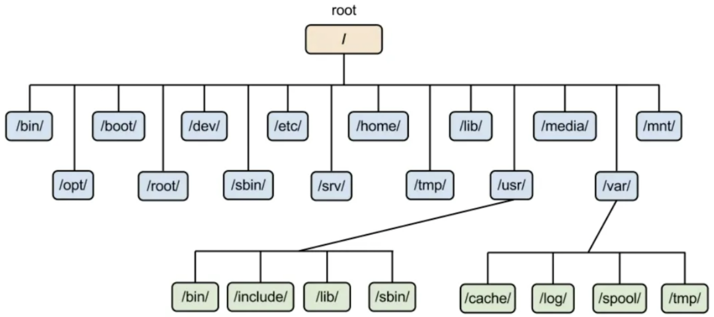
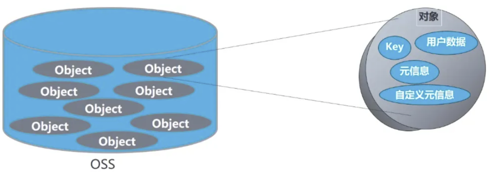
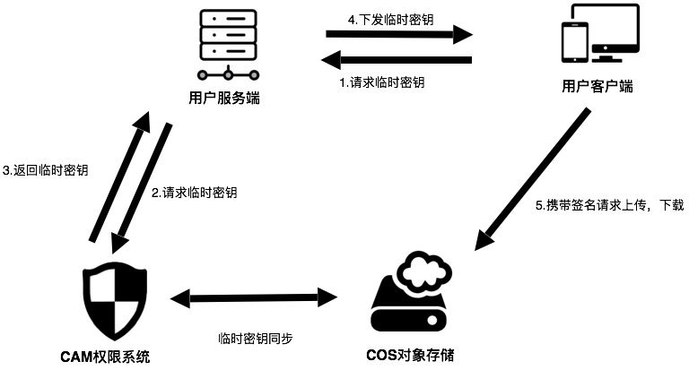

## COS

​		COS = Cloud Object Storage，即云对象存储，是腾讯云提供的对象存储服务。如果非要下正式定义，那么对象存储是一种使用 **RESTful API** 存储和检索**非结构化**数据和元数据对象的工具。如果用正常语言来解释，可以把对象存储类比为云盘，只不过我们可以通过网络请求进行下载、上传等操作。

> 阿里云也提供对象存储服务（OSS）。由于科协网站采用的是腾讯云的 COS，在这里我们只对 COS 进行更详细的介绍。

​		所谓“非结构化数据和元数据”，就是说 COS 将数据和元数据（描述数据的数据）封装到对象中，而这些对象存储在**平面结构**或地址空间中。每个对象都分配一个对象 ID（唯一标识符），使它们可以从**单个**存储库中检索。这就跟平常存储中结构化的数据很不一样。

​		Linux 文件系统的树状结构（结构化的）：



​		COS 文件系统的扁平结构（非结构化的）：




### 相关概念

- **Object（对象）**：COS 中的基本数据单元，包括文件数据和元数据。
- **Bucket（存储桶）**：COS 中用于存储对象的容器，每个对象都必须属于一个存储桶，一个存储桶可容纳无数个对象。**无文件夹和目录的概念。**
- **Region（地域）**：COS 的物理数据中心位置，用户可以选择离自己业务最近的地域以降低延迟。
- **Endpoint（访问域名）**：用于访问 COS 服务的网络地址。每个地域都有对应的 Endpoint。通过内网和外网访问同一个 Region 所需要的 Endpoint 也是不同的。以腾讯云为例，参见 [地域与访问域名](https://cloud.tencent.com/document/product/436/6224)。
- **AccessKey（访问密钥）**：包括 AccessKeyId 和 AccessKeySecret，是用于身份验证的凭证。

### 存储桶命名规范

- 只能包括小写字母、数字和短划线（-）。
- 必须以小写字母或者数字开头和结尾。
- 长度必须在 3~63 字符之间。
- 实际命名自由度可能更大，但建议遵循这些规范以确保兼容性和避免冲突。

### 适用场景

- **备份和归档**：存储和管理数据备份文件和归档数据。
- **大数据分析**：存储大规模数据集。
- **多媒体存储和分发**：存储和分发图片、音视频等多媒体文件。
- **Web 内容托管**：存储和分发网站**静态**资源。

### *不适用* 的场景

- **实时数据库应用**：由于对象存储不支持部分更新，每次修改都需要重新上传整个对象，导致维护成本高，不适合需要频繁读写和更新的数据库应用。
- **高频小文件读写**：大量的小文件读写操作会导致性能和费用问题，适合使用本地文件系统或分布式文件系统。
- **操作系统级文件操作**：操作系统无法像挂载常规磁盘一样挂载对象存储，限制了需要文件系统级别操作的应用。

### OSS 与文件系统的对比

|    对比项    |                             OSS                              |                           文件系统                           |
| :----------: | :----------------------------------------------------------: | :----------------------------------------------------------: |
| **数据模型** |     分布式对象存储服务，提供 Key-Value 对形式的对象存储      |                      典型的树状索引结构                      |
| **数据获取** | 根据对象名称（Key）唯一获取对象内容；对象名称仅为字符串，不涉及目录层级 |                  通过路径依次访问目录和文件                  |
|   **优势**   | 支持海量用户并发访问；可扩展性强；冗余存储，数据可靠性高；支持内容分发网络 CDN 加速；支持流式写入读出 | 支持文件修改（偏移内容、截断等）和文件夹操作（重命名、删除、移动等） |
|   **劣势**   | 不支持对象内容修改，所谓修改即重新上传整个对象；模拟文件夹功能代价高，如重命名目录需重新复制所有文件夹内对象 |    受限于单设备性能，访问深层目录和大文件夹操作消耗资源大    |


### 权限管理

#### 公共权限

​		公共权限包括：私有读写、公有读私有写和公有读写。其访问权限可通过对象存储控制台上的存储桶的**权限管理**进行修改，更多访问权限的说明，请参见 [访问控制基本概念](https://cloud.tencent.com/document/product/436/30749)。

- **私有读写**： 只有该存储桶的创建者及有授权的账号才对该存储桶中的对象有读写权限，其他任何人对该存储桶中的对象都没有读写权限。存储桶访问权限默认为私有读写，推荐使用。
- **公有读私有写**： 任何人（包括匿名访问者）都对该存储桶中的对象有读权限，但只有存储桶创建者及有授权的账号才对该存储桶中的对象有写权限。
- **公有读写**： 任何人（包括匿名访问者）都对该存储桶中的对象有读权限和写权限，不推荐使用。

#### 用户权限

​		主账号默认拥有存储桶的所有权限（即完全控制）。另外 COS 支持添加子账号有数据读取、数据写入、权限读取、权限写入，甚至完全控制的最高权限。


### 控制台使用

1. 访问 [腾讯云](https://cloud.tencent.com/)，注册或登录
2. 依次点击产品-存储-对象存储-立即使用（找不到按钮 Ctrl-F），进入存储桶控制台。
3. 点击“创建存储桶”，然后完善相关信息，点击下一步。
4. 后续的高级可选配置可以先直接默认下一步，最后确认创建成功。
5. 查看 [存储桶列表](https://console.cloud.tencent.com/cos/bucket)，通过控制台方式访问存储桶，上传文件、创建文件夹、清空存储桶等。


### 存储桶访问

​		腾讯云提供了多种访问存储桶的方式，分别是：控制台、COSBrowser 工具、COSCMD 工具、API 方式、SDK 方式，其中控制台方式就是在腾讯云网页中进行操作，同学们可以自行探索。这里主要讲解用 SDK 方式进行访问的方式。

​		SDK 接口是腾讯云提供的封装好的库，简化了与 COS 服务的交互过程。SDK 处理了很多底层细节，比如请求签名、错误处理、重试机制等，开发者只需要关注业务逻辑。

​		官网提供了很多 SDK，我们主要展示 Nodejs 的 SDK。


#### 获取临时密钥

​		腾讯云 COS 服务在使用时需要对请求进行访问管理。通过临时密钥机制，我们可以临时授权 App 访问存储资源，而不会泄露永久密钥。控制流程如下图。



1. 获取永久密钥：用户或应用程序通过受保护的 API 接口发出生成临时密钥的请求，经身份验证后，后台服务器生成临时密钥。临时密钥需要通过永久密钥才能生成。永久密钥包含 `SecretId` 与 `SecretKey`，可登录 [腾讯云访问管理控制台](https://console.cloud.tencent.com/cam/capi) 获取。

2. QCloud COS 服务临时密钥 SDK：[[Github]](https://github.com/tencentyun/qcloud-cos-sts-sdk)

   - 安装包

     ```bash
     yarn add qcloud-cos-sts@3.1.0
     ```

   - 导入包

     ```tsx
     import STS from "qcloud-cos-sts";
     ```

   - 配置参数

     ```tsx
     const config = {
       secretId: process.env.GROUP_SECRET_ID!,   // 固定密钥
       secretKey: process.env.GROUP_SECRET_KEY!,  // 固定密钥
       proxy: '',
       host: 'sts.tencentcloudapi.com', // 域名，非必须，默认为 sts.tencentcloudapi.com
       // endpoint: 'sts.internal.tencentcloudapi.com', // 域名，非必须，与host二选一，默认为 sts.tencentcloudapi.com
       durationSeconds: 1800,  // 密钥有效期
       // 放行判断相关参数
       bucket: 'test-bucket-1253653367', // 换成你的 bucket
       region: 'ap-beijing', // 换成 bucket 所在地区
     };
     ```

   - 通过 `Scope` 的方式细粒度的控制返回密钥的权限，获取 policy 接口

     ```tsx
     const scope = [{
         action: ["name/cos:GetObject", 'name/cos:PutObject'],
         bucket: config.bucket,
         region: config.region,
         prefix: 'exampleobject', // 这里改成允许的路径前缀，可以根据自己网站的用户登录态判断允许上传的具体路径，例如： a.jpg 或者 a/* 或者 * (使用通配符*存在重大安全风险, 请谨慎评估使用)
       }];
     const policy = STS.getPolicy(scope);
     ```

   - 获取临时密钥

     ```tsx
     const getSTS: any = async (action: string[], prefix: string) => {
         const config = ...;
         const scope = ...;
         const policy = ...;
         return new Promise((resolve, reject) => STS.getCredential({
             secretId: config.secretId,
             secretKey: config.secretKey,
             proxy: config.proxy,
             policy: policy,
             durationSeconds: config.durationSeconds,
         }, (err, credential) => {  // 回调
             console.log('getCredential:');
        	 		console.log(err || credential);
             if (err) reject(err);
             else resolve(credential);
         }))
     };
     ```

   

#### 创建实例

1. 腾讯云 COS Nodejs SDK：[[GitHub]](https://github.com/tencentyun/cos-nodejs-sdk-v5)

   - 安装包

     ```bash
     yarn add cos-nodejs-sdk-v5@2.14.3
     ```

   - 导入包

     ```tsx
     import COS from "cos-nodejs-sdk-v5";
     ```

   - 创建实例

     ```tsx
     const cos = new COS({
       getAuthorization: async (options, callback) => { // 初始化时不会调用，只有调用 cos 方法（例如 cos.putObject）时才会进入
         try {
           if (!sts) throw (Error("Credentials invalid!"));
           callback({
             TmpSecretId: sts.credentials.tmpSecretId,  // 临时密钥的 tmpSecretId
             TmpSecretKey: sts.credentials.tmpSecretKey,  // 临时密钥的 tmpSecretKey
             SecurityToken: sts.credentials.sessionToken,  // 临时密钥的 sessionToken
             StartTime: sts.startTime,  // 时间戳，单位秒，如：1580000000
             ExpiredTime: sts.expiredTime,  // 临时密钥失效时间戳，是申请临时密钥时的时间戳 + durationSeconds
             ScopeLimit: true,  // 细粒度控制权限需要设为 true，会限制密钥只在相同请求时重复使用
           });
         } catch (err) {
           console.log(err);
         }
       }
     });
     ```


#### Object 接口

1. HEAD Object：判断指定对象是否存在和有权限，并在指定对象可访问时获取其元数据。

   ```tsx
   cos.headObject({
       Bucket: config.Bucket,
       Region: config.Region,
       Key: '1.jpg',
   }, (err, data) => {
       console.log(err || data);
   });
   ```

2. GET Object：将 COS 存储桶中的对象（Object）下载至本地。

   ```tsx
   import fStream from 'fs';
   cos.getObject({
       Bucket: config.Bucket,
       Region: config.Region,
       Key: '1.jpg',
       Output: fStream.createWriteStream(outputPath),  // 下载文件到指定写文件流
   }, (err, data) => {
   		console.log(err || data);
   });
   ```

3. PUT Object：简单上传文件，适用于小文件上传。

   ```tsx
   const filePath = "temp-file-to-upload" // 本地文件路径
   const fileStream = fStream.createReadStream(filePath);
   fileStream.on('error', (err) => {
     console.log('File Stream Error', err);
   });
   cos.putObject({
       Bucket: config.Bucket,
       Region: config.Region,
       Key: '1.jpg',
       Body: fileStream,
   }, (err, data) => {
       console.log(err || data);
   });
   ```

4. DELETE Object：在 COS 的存储桶中将一个对象（Object）删除。

   ```tsx
   cos.deleteObject({
       Bucket: config.Bucket,
       Region: config.Region,
       Key: '1.jpg',
   }, (err, data) => {
       console.log(err || data);
   });
   ```

5. 更多用法如按前缀下载多个对象、分块并发下载、高级上传、分块上传等，参见 [Node.js SDK—对象操作](https://cloud.tencent.com/document/product/436/64958) 及 [API 文档—Object 接口](https://cloud.tencent.com/document/product/436/7739)。


#### Bucket 接口

​		参见 [Node.js SDK—存储桶操作](https://cloud.tencent.com/document/product/436/36118)、[API 文档—Service 接口](https://cloud.tencent.com/document/product/436/8290) 及 [API 文档—Bucket 接口](https://cloud.tencent.com/document/product/436/7731)。


#### 访问控制

​		参加 [Node.js SDK—访问控制](https://cloud.tencent.com/document/product/436/51854) 及 [API 文档—访问控制](https://cloud.tencent.com/document/product/436/35122)

